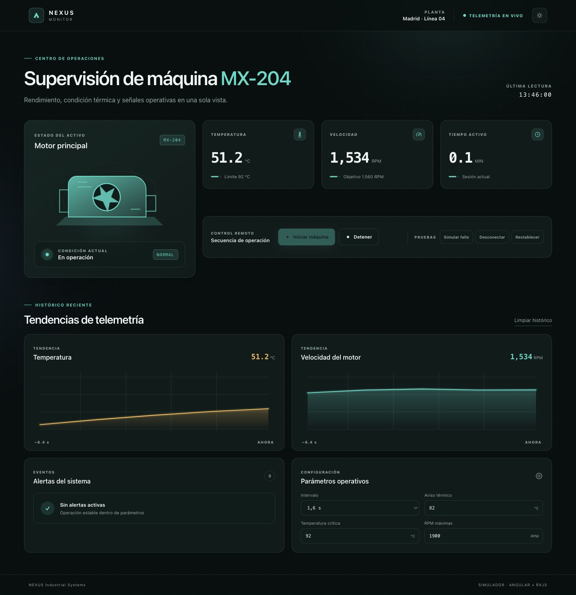
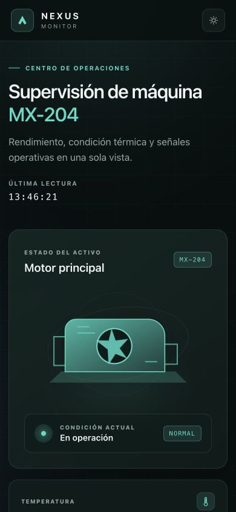

# NEXUS Machine Dashboard

[](https://github.com/revyalo/machine-dashboard/actions/workflows/ci.yml)
[](https://github.com/revyalo/machine-dashboard/actions/workflows/deploy-pages.yml)
[](https://angular.dev/)
[](https://revyalo.github.io/machine-dashboard/)

Dashboard industrial responsive para supervisar una máquina simulada en tiempo real. Centraliza temperatura, RPM, tiempo activo, histórico, alertas y controles operativos en una interfaz pensada como un pequeño sistema de monitorización de planta.

**[Ver demo](https://revyalo.github.io/machine-dashboard/)**



## Qué incluye

- Telemetría simulada en tiempo real con RxJS (`interval`, `map`, `takeUntil`).
- Estado fuertemente tipado con interfaces, tipos y `MachineStatus`.
- Histórico limitado de temperatura y RPM con gráficos SVG sin dependencias externas.
- Alertas de warning/critical por temperatura, RPM, desconexión y fallo del sistema.
- Estados visuales diferenciados: normal, warning, critical y stopped.
- Controles para iniciar, detener, restablecer y simular incidencias.
- Configuración persistente de intervalo y umbrales mediante `localStorage`.
- Tema oscuro/claro persistente y layout responsive para escritorio, tablet y móvil.
- Accesibilidad básica: HTML semántico, labels, foco visible, navegación por teclado, estados anunciados y soporte para movimiento reducido.
- Tests unitarios de servicio, integración de controles y shell principal.
- Calidad automatizada con ESLint, Prettier, GitHub Actions y despliegue continuo.

<p align="center">
  
</p>

## Stack

| Capa           | Tecnología                                     |
| -------------- | ---------------------------------------------- |
| UI             | Angular 20, standalone components, Signals     |
| Estado y datos | RxJS 7, `BehaviorSubject`, streams cancelables |
| Gráficos       | SVG nativo                                     |
| Persistencia   | Web Storage API                                |
| Tests          | Jasmine, Karma, Chrome Headless                |
| Calidad        | TypeScript strict, ESLint, Prettier            |
| CI/CD          | GitHub Actions + GitHub Pages                  |

## Arquitectura

La UI sólo representa estado y emite intenciones. Toda la simulación, los umbrales, el histórico y la persistencia viven en `MachineService`.

```text
UI / Dashboard
      ↓ acciones                         ↑ Signals
Componentes presentacionales ← MachineDashboard
                                      ↓
                               MachineService
                          ↙          ↓          ↘
                   RxJS State   Alert Engine   History
                          ↖          ↑          ↗
                         Simulated Data Source
                                      ↓
                                localStorage
```

### Componentes principales

```text
MachineDashboard
├── StatusCard
├── TelemetryCard × 3
├── ControlPanel
├── TelemetryChart × 2
├── AlertPanel
└── SettingsPanel
```

`MachineService` expone streams de sólo lectura (`state$`, `history$`, `alerts$`, `config$`). El dashboard los convierte en Signals con `toSignal`, mientras que el ciclo de telemetría se detiene con `takeUntil` y `takeUntilDestroyed` para evitar fugas de memoria.

## Ejecutar en local

Requisitos: Node.js 20+ y npm.

```bash
git clone https://github.com/revyalo/machine-dashboard.git
cd machine-dashboard
npm install
npm start
```

Abre [http://localhost:4200](http://localhost:4200).

## Scripts

```bash
npm start          # servidor de desarrollo
npm run build      # bundle de producción
npm run test:ci    # tests una sola vez en Chrome Headless
npm run lint       # análisis estático
npm run format     # formatea el proyecto
```

## Tests y CI

Cada push y pull request ejecuta automáticamente:

1. instalación reproducible con `npm ci`;
2. comprobación de formato;
3. lint;
4. tests unitarios en Chrome Headless;
5. build optimizado de producción.

Los pushes a `master` también publican la demo en GitHub Pages.

## Roadmap

- [ ] Conectar un gateway real mediante WebSocket o MQTT.
- [ ] Exportar históricos en CSV.
- [ ] Añadir múltiples máquinas y comparación entre activos.
- [ ] Reconocimiento y trazabilidad de alertas.
- [ ] Tests end-to-end con Playwright.

## Licencia

Proyecto de portfolio y demostración técnica.
